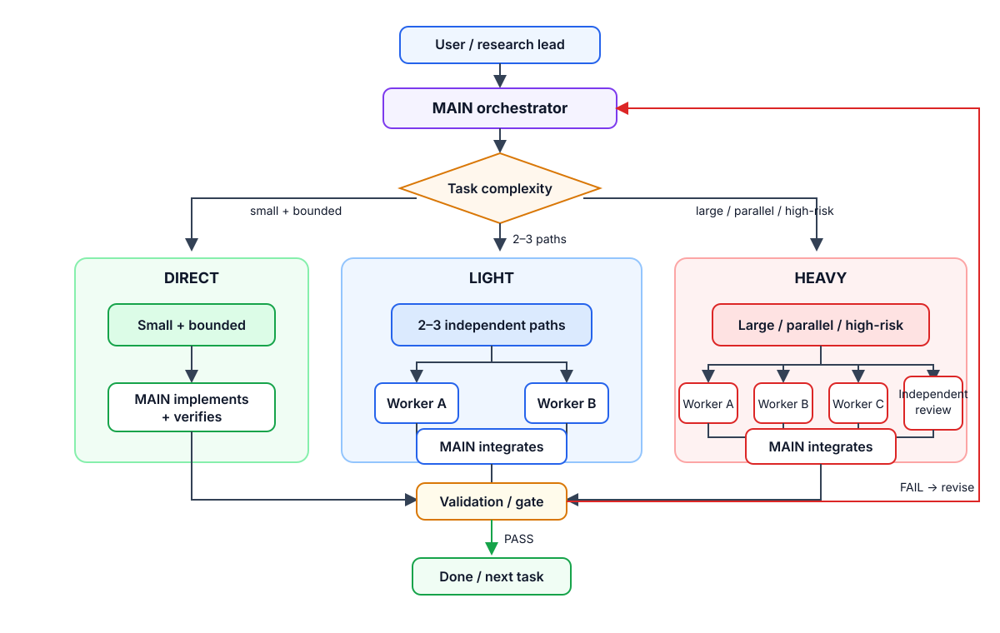
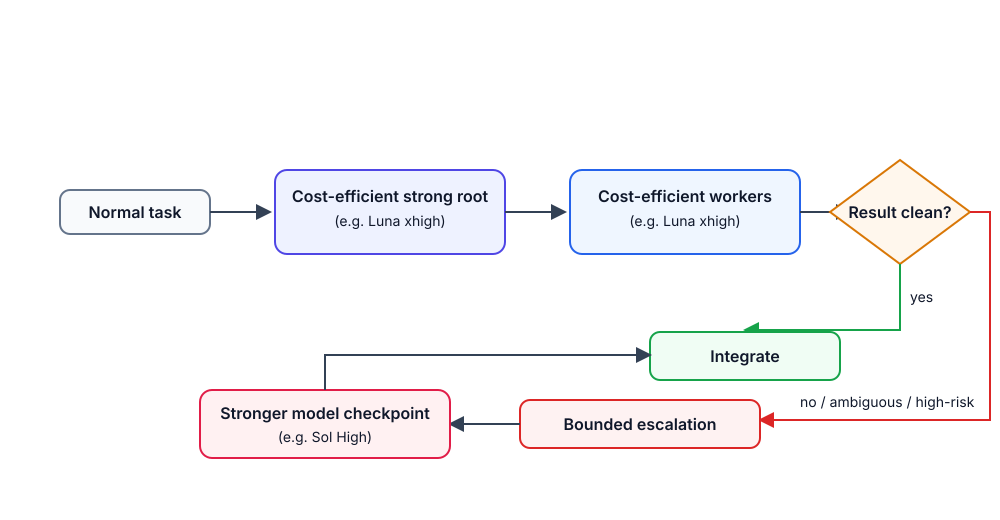
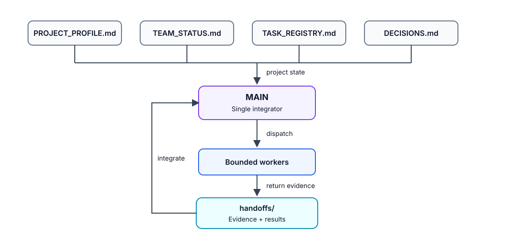

# Codex Orchestra

Reusable, runtime-agnostic control plane for multi-agent research and engineering.

The goal is not to maximize agent count. The goal is to **reduce wall-clock time by launching useful independent work as early as possible without weakening validation, ownership, or research gates**.

`main` is the generic template. Project branches are snapshots/configurations, not automatically synchronized mirrors:

- `orchestra/us-stock`
- `orchestra/idx-trade`
- `orchestra/biohub`

No project source code, private runtime data, model artifacts, credentials, or caches belong in this repository.

## How it works

  

### Orchestration levels

| Level | Use when | Default shape |
|---|---|---|
| **DIRECT** | Small or inherently sequential work with no useful parallel frontier | MAIN works directly |
| **LIGHT** | Normal meaningful work with 2–3 independent ready workstreams | MAIN + 1–3 workers in parallel |
| **HEAVY** | 3–6 genuinely independent critical-path workstreams, broad migration/research, or decision-changing independent review | MAIN + 3–6 workers/reviewer |

**LIGHT is the normal topology for meaningful work.** A substantial task may stay DIRECT only when MAIN can explain why spawning workers would not materially shorten the critical path.

Before implementation, MAIN performs a short parallelism preflight:

1. What work can start **now** without waiting on another result?
2. Which scopes are independent and non-overlapping?
3. Which work should MAIN retain because it is coupled to integration or final judgment?
4. Which ready scopes should be spawned immediately?

Workers should be launched **before** MAIN starts doing the same parallelizable work itself. MAIN must not hoard independent critical-path work merely because it can complete it alone.

## Speed without blind parallelism

Parallelize orthogonal work, not scientific dependencies.

Good parallelism:

- implementation + independent tests + audit;
- backend + frontend contract inspection + regression coverage;
- source audit + code inspection + validation review;
- multiple independent root-cause investigations.

Bad parallelism:

- duplicating the same implementation across workers without a comparison plan;
- launching later experiments whose specification should depend on an earlier result;
- giving concurrent writers overlapping file ownership;
- spawning workers only because capacity exists.

For research, preserve sequential learning between decision-dependent experiments while parallelizing implementation, leakage/PIT audit, validation, and infrastructure around the current experiment.

## Model routing

  

Model strength and orchestration intensity are independent:

- persistent MAIN/root: cost-efficient strong reasoning model;
- routine workers: usually the same cost-efficient strong model;
- stronger/expensive model: **bounded decision-changing escalation**, not permanent orchestration overhead;
- explicit user model policy always wins.

For the current IDX workflow, the intended mapping is **Luna xhigh** for MAIN/workers, with **Sol High** reserved for difficult architecture conflicts, repeated failures, suspicious research results, or final high-risk gates.

## Control plane

  

`MAIN` is the sole decomposer, integrator, and phase-transition authority. Workers execute bounded assignments and return evidence; they do not independently redefine project scope, frozen gates, or orchestration policy.

The control plane is runtime-agnostic. Native Codex sessions, isolated worktrees, Xirp, terminal/tmux layouts, or another session manager can provide the execution layer. Orchestra decides **what should run, what can run together, who owns it, and what evidence is required before integration**.

## Status freshness

Project branches in this repository are snapshots. They **do not update automatically** when the source project advances.

Each project profile should name its source-of-truth status document/branch and record the last synchronized source commit. On a material milestone, phase transition, or source-HEAD change, MAIN refreshes the project snapshot. If the project snapshot conflicts with the source repository, the source repository wins and the orchestra snapshot is `STALE` until refreshed.

## Recommended use

1. Copy `AGENTS.md`, `coordination/`, and optionally `docs/ORCHESTRATION.md` into the target project.
2. Fill `coordination/PROJECT_PROFILE.md`, including the source-status sync contract and concurrency policy.
3. For every non-trivial task, run the parallelism preflight before implementation.
4. Start DIRECT only for genuinely small/sequential work; use LIGHT for normal meaningful work; promote to HEAVY when the ready execution frontier is wide enough to justify it.
5. Spawn independent work early, keep ownership disjoint, and let MAIN integrate only verified evidence.
6. De-escalate after the milestone; do not keep workers alive when the frontier collapses back to sequential work.

## Files

- `AGENTS.md` — generic orchestration contract and mandatory parallelism preflight.
- `coordination/PROJECT_PROFILE.md` — per-project model, concurrency, source/status, and gate configuration.
- `coordination/TEAM_STATUS.md` — current phase, execution frontier, active workers, and freshness state.
- `coordination/TASK_REGISTRY.md` — task ownership, dependencies, parallel groups, and status.
- `coordination/DECISIONS.md` — append-only material decisions.
- `coordination/WORKER_PROMPT_TEMPLATE.md` — bounded worker assignment template.
- `coordination/handoffs/` — worker evidence and handoffs.
- `docs/ORCHESTRATION.md` — detailed latency-aware operating loop.
