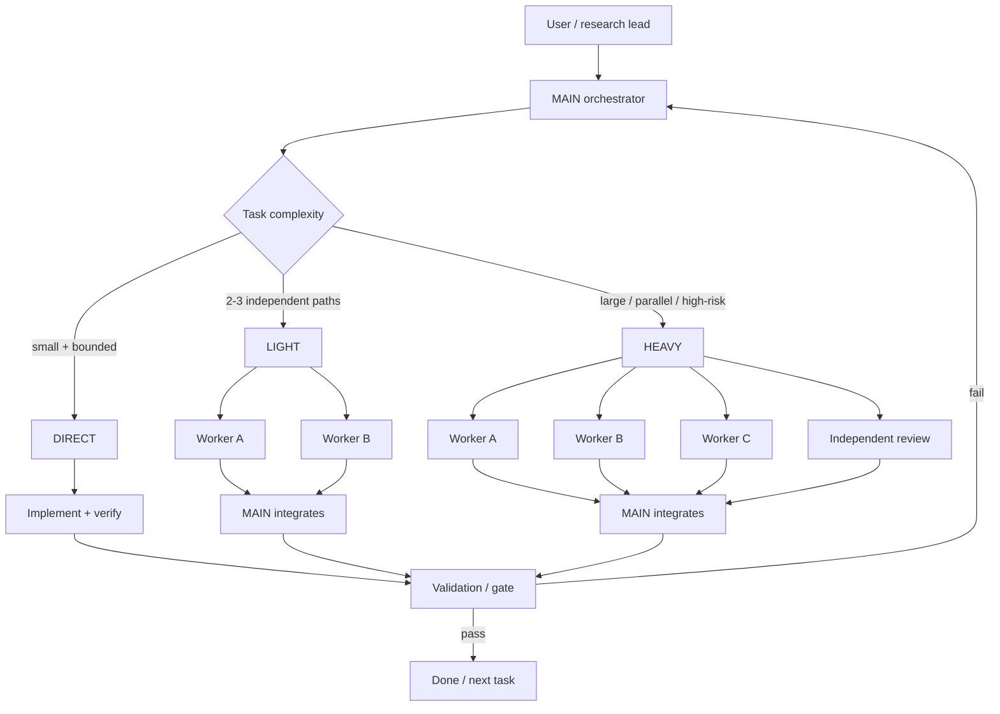
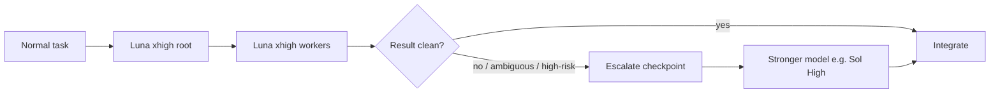
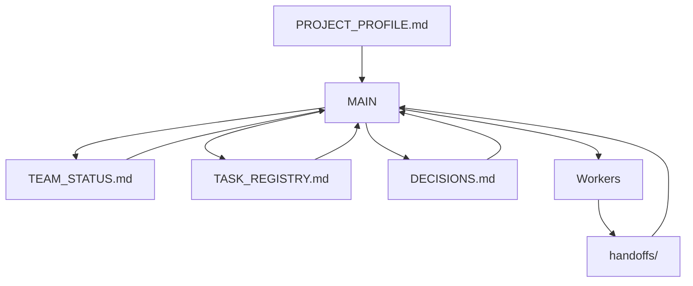

# Codex Orchestra

Reusable settings-only control plane for Codex multi-agent projects.

`main` is the generic template. Project branches are examples/snapshots, not sources to merge wholesale:

- `orchestra/us-stock`
- `orchestra/idx-trade`
- `orchestra/biohub`

No project source code, market/competition data, model artifacts, credentials, or runtime caches belong in this repository.

## How it works

### Orchestration levels

| Level | Use when | Shape |
|---|---|---|
| **DIRECT** | One bounded task, little coordination value | MAIN works directly |
| **LIGHT** | A few independent workstreams can run in parallel | MAIN + 2-3 workers |
| **HEAVY** | Large/high-risk work with real parallelism or independent review | MAIN + multiple workers/reviewer |

The rule is simple: **do not spawn workers just because slots exist.** Start DIRECT and promote only when parallelism helps the critical path.

## Model routing

Default philosophy:

- persistent root: cost-efficient strong reasoning model;
- normal workers: same cost-efficient strong model;
- expensive model: **bounded escalation**, not persistent orchestration overhead;
- user-selected model policy always overrides the default.

For the current IDX workflow, the intended mapping is **Luna xhigh** for root/workers, with **Sol High** reserved for difficult architecture conflicts, repeated failures, suspicious research results, or final high-risk gates.

## Control plane

`MAIN` is the single integrator. Workers execute bounded assignments and return evidence through handoffs; they do not independently redefine project scope or orchestration policy.

## Recommended use

1. Copy `AGENTS.md`, `coordination/`, and optionally `docs/ORCHESTRATION.md` into the target project.
2. Fill `coordination/PROJECT_PROFILE.md` with project identity, repositories, operating mode, roles, gates, and model policy.
3. Initialize `TEAM_STATUS.md`, `TASK_REGISTRY.md`, and `DECISIONS.md`.
4. Keep generic orchestration rules stable; project-specific constraints belong in the project profile or target repository contracts.
5. Start with `DIRECT`, promote to `LIGHT` when independent work helps, and use `HEAVY` only for genuinely parallel/high-risk work.

## Files

- `AGENTS.md` — generic orchestration contract.
- `coordination/PROJECT_PROFILE.md` — per-project configuration.
- `coordination/TEAM_STATUS.md` — current phase/status, MAIN-owned.
- `coordination/TASK_REGISTRY.md` — task ownership/dependencies/status.
- `coordination/DECISIONS.md` — append-only material decisions.
- `coordination/handoffs/` — worker evidence and handoffs.
- `docs/ORCHESTRATION.md` — detailed operating loop and level-selection guide.
